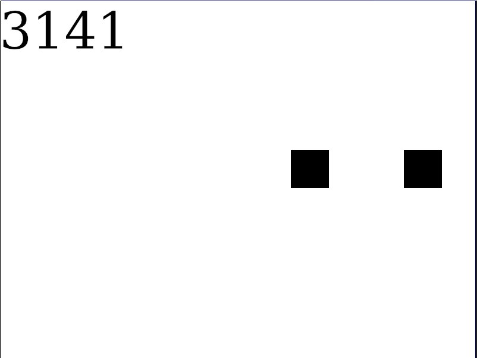

# Calculating Pi with collisions

This repository contains a simulation created in Rust. The simulation
demonstrates how the amount of collisions between some block with mass $`1`$ and
another block with mass $`100^{n - 1}`$, where $`n`$ is amount of digits wanted to
compute, equals $`\Pi`$. It's written in Rust using `ggez`.



# How to run?

First install `Rustup`: [How to install?](https://www.rust-lang.org/tools/install)
With the Rust compiler installed, run the following commands:

```shell
git clone https://gitlab.com/knarkzel/pi-with-collisions
cd pi-with-collisions/
cargo run
```
