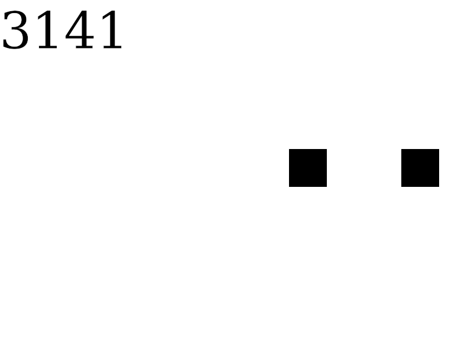

# Calculating Pi with collisions

This repository contains a simulation between two elastically colliding blocks
with different masses. The simulation
demonstrates how the amount of collisions between a block with mass $`1`$ and
another block with mass $`100^{n - 1}`$, where $`n`$ is amount of digits 
to compute, equals $`\Pi`$. It's written in Rust using `ggez`. To understand why
this occurs, refer to following video: 
[Why do colliding blocks compute pi?](https://www.youtube.com/watch?v=jsYwFizhncE).
You can also read this article: 
[Throwing pi at a wall](https://arxiv.org/pdf/1901.06260.pdf)



# How to run?

First install `Rustup`: [How to install?](https://www.rust-lang.org/tools/install)
With the Rust compiler installed, run the following commands:

```shell
git clone https://gitlab.com/knarkzel/pi-with-collisions
cd pi-with-collisions/
cargo run
```
